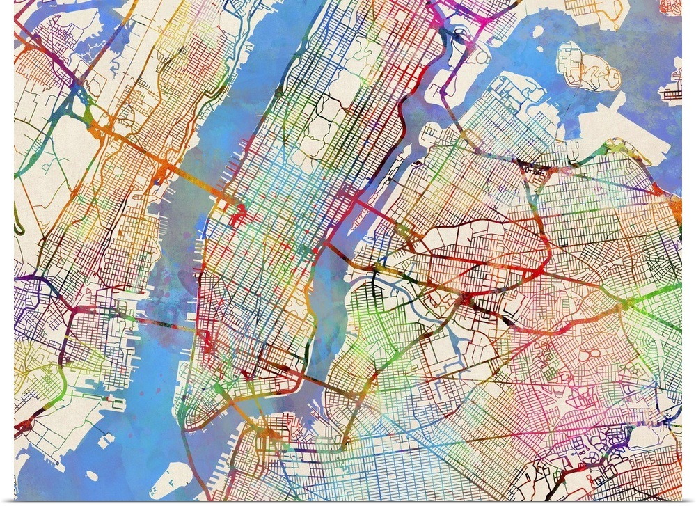
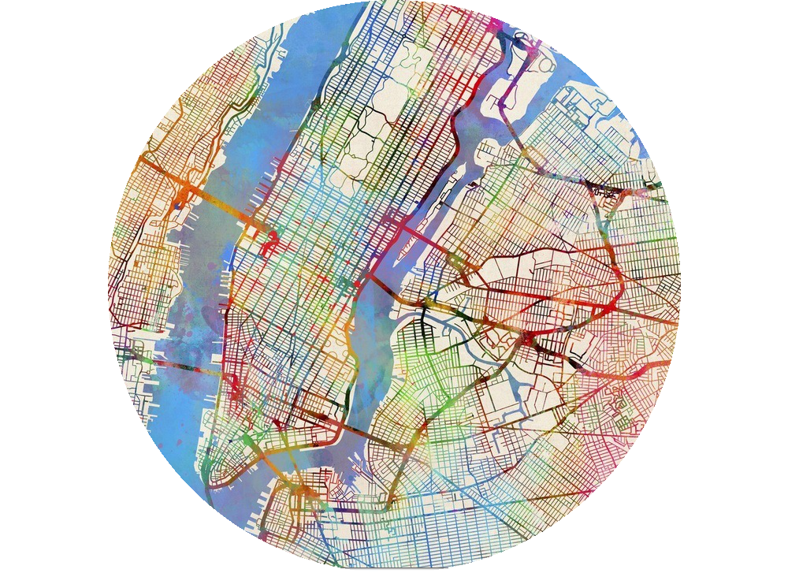
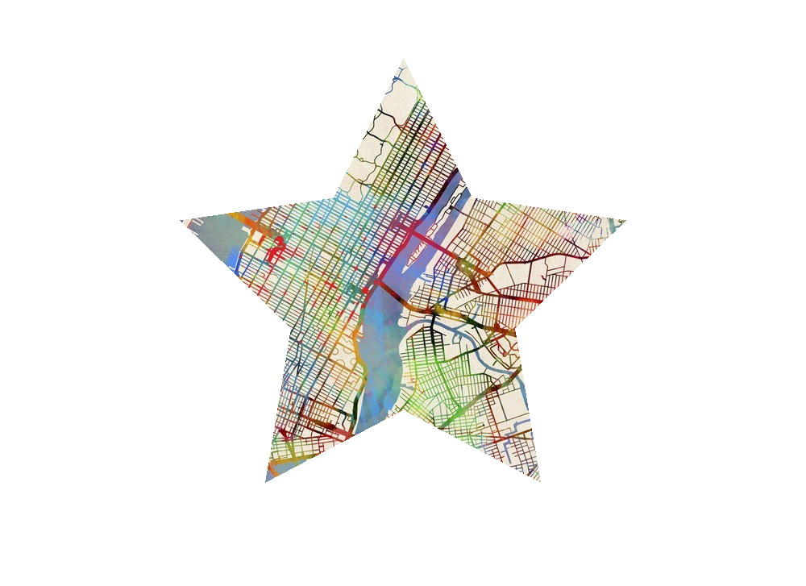

# Croppy 🌟


## Introduction 📜
**Croppy** is a Python package designed to effortlessly transform images into various shapes. Whether you're looking to craft circles, triangles, rectangles, or stars from your images, this package has got you covered!

## Features ✨
- **Versatile Shapes**: From basic shapes like circles to complex ones like stars.
- **Transparent Background**: Resulting images have a transparent background, making them perfect for designs and presentations.
- **Easy to Use**: Just a few lines of code!

## Installation 📦
1. Clone the repository: `git clone https://github.com/MohanadDiab/Croppy.git`
2. Navigate to the directory: `cd Croppy`
3. Install the requirements: `pip install -r requirements.txt`

## Usage with Examples 🌈

### Basic Usage:
```python
from Croppy.basic_shapes import create_circle_mask
from Croppy.core import apply_mask_with_transparency

# Create a circle mask
mask = create_circle_mask(width, height)

# Apply the mask to the image
apply_mask_with_transparency('path_to_image.jpg', mask, 'output_image.png')
```

### Visual Examples:

**Original Image:**


**Circle:**


**Star:**


## Contributing 🤝
Pull requests are welcome. For major changes, please open an issue first to discuss what you'd like to change.

## License 📄
[MIT](https://choosealicense.com/licenses/mit/)
